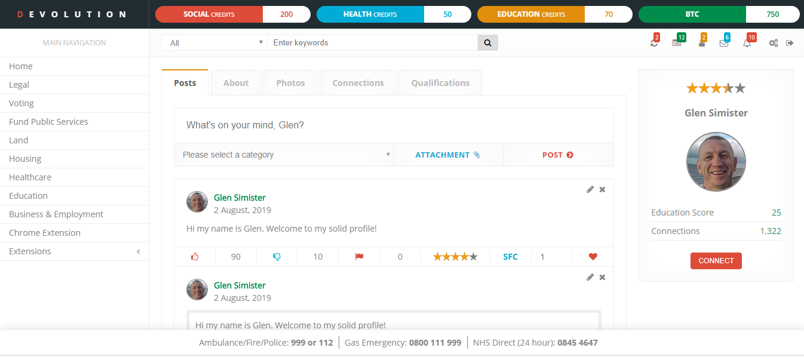

<h3>DEVOLUTION</h3>

<i>“Give a man a fish, he feeds himself for a day. Give a man the means to catch a fish, he feeds himself for a lifetime”</i>

<h3>You can view a <a href="https://glensimister.github.io/devolution/">DEMO</a> here.</h3>

There's also a youtube video...

<a href="https://www.youtube.com/watch?v=v83KDHyyNjg">https://www.youtube.com/watch?v=v83KDHyyNjg</a>

The prototype was built using the safenetwork browser/api; however, I have decided to build a centralized prototype instead to make things easier. 

